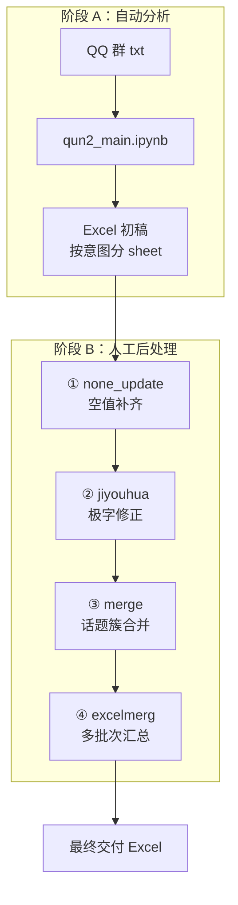

# 玩家社群分析智能体 · 研发侧工作流

本仓库汇总「玩家社群分析智能体」**研发侧**完整交付链路：大模型自动分类 + 分析后人工数据修复。

## 仓库结构

```
player-community-workflow/
├── README.md                    # 本文件（总览）
├── qun2_main_workflow/          # 阶段 A：自动分析（测试2群）
│   ├── qun2_main.ipynb
│   ├── scripts/                 # data_processing、model_classifyV1_Copy1
│   ├── prompts/                 # 四阶段大模型提示词
│   ├── data/                    # 群聊 txt、mapping、白名单
│   └── README.md
└── data_repair/                 # 阶段 B：分析后人工数据处理
    ├── none_update.py           # ① 空值补齐
    ├── jiyouhua.py              # ② 「极」字修正
    ├── merge.py                 # ③ 单文件话题簇列合并
    ├── excelmerg.py             # ④ 多文件最终汇总（最后一步）
    └── README.md                # 逐步操作说明
```

## 端到端流程



| 阶段 | 目录 | 说明 |
|------|------|------|
| A. 自动分析 | `qun2_main_workflow/` | 解析群聊 → 四阶段大模型分类 → 输出 Excel |
| B. 数据修复 | `data_repair/` | 空值补齐 → 极字修正 → 合并单元格 → 多文件汇总 |

## 快速开始

### 阶段 A：运行 qun2_main

```bash
cd qun2_main_workflow
pip install -r requirements.txt
# 配置环境变量 ARK_API_KEY，在 Jupyter 中打开 qun2_main.ipynb 按单元格运行
```

详见 [qun2_main_workflow/README.md](qun2_main_workflow/README.md)

### 阶段 B：数据修复（四步）

```bash
cd data_repair
pip install pandas openpyxl

# 按顺序执行，每步修改脚本底部文件路径后运行：
python none_update.py    # ① 空值补齐
python jiyouhua.py       # ② 极字修正
python merge.py          # ③ 单文件话题簇合并
python excelmerg.py      # ④ 多文件最终汇总
```

详见 [data_repair/README.md](data_repair/README.md)

## 安全说明

- API Key 通过环境变量 `ARK_API_KEY` 配置，勿写入仓库。
- 群聊 txt 仅作示例，生产环境请通过内部渠道分发。

## 来源

抽取自本地项目 `玩家社群分析智能体`：

- `玩家发言分类（供研发侧）/玩家社群发言整理工作流`
- `玩家发言分类（供研发侧）/数据修复/`
