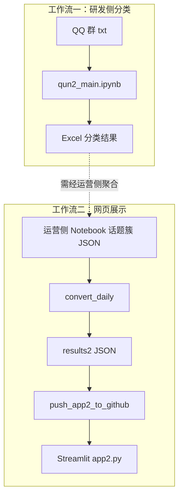

# 玩家社群分析智能体 · 工作流文档

本仓库汇总「玩家社群分析智能体」项目中两条可独立交付的工作流，便于研发/运营侧查阅、运行与部署。

## 仓库结构

```
player-community-workflow/
├── README.md                          # 本文件（总览）
├── qun2_main_workflow/                # 工作流一：研发侧玩家发言分类（测试2群）
│   ├── qun2_main.ipynb
│   ├── scripts/                       # data_processing、model_classifyV1_Copy1
│   ├── prompts/                       # 四阶段大模型提示词
│   ├── data/                          # 群聊 txt、mapping、白名单
│   └── README.md
└── streamlit_push_workflow/           # 工作流二：结果推送到 Streamlit 网页
    ├── app2.py
    ├── convert/                       # AI 输出 → results2 JSON
    ├── push_app2_to_github.py
    ├── results2/                      # 网页数据源结构
    └── README.md
```

## 端到端关系



| 工作流 | 目录 | 输入 | 输出 | 受众 |
|--------|------|------|------|------|
| 研发侧分类 | `qun2_main_workflow/` | QQ 群 txt | Excel（按意图分 sheet） | 研发 |
| Streamlit 推送 | `streamlit_push_workflow/` | 话题簇 JSON 列表 | GitHub → Streamlit 网页 | 运营/对外展示 |

## 快速开始

### 工作流一：qun2_main（研发侧）

```bash
cd qun2_main_workflow
pip install -r requirements.txt
# 配置环境变量 ARK_API_KEY，在 Jupyter 中打开 qun2_main.ipynb 运行
```

详见 [qun2_main_workflow/README.md](qun2_main_workflow/README.md)

### 工作流二：Streamlit 推送

```bash
# 1. 转换 AI 输出
cd streamlit_push_workflow
python convert/convert_daily_from_file.py

# 2. 本地预览
pip install -r requirements.txt
streamlit run app2.py

# 3. 推送到 GitHub（需在已配置的 git 仓库中运行 push 脚本）
```

详见 [streamlit_push_workflow/README.md](streamlit_push_workflow/README.md)

## 安全说明

- 请勿将 API Key 提交到仓库；`qun2_main.ipynb` 通过环境变量 `ARK_API_KEY` 读取密钥。
- 群聊原始数据（txt）仅作示例，生产环境请使用内部渠道分发。

## 来源

内容抽取自本地项目 `玩家社群分析智能体`，对应目录：

- `玩家发言分类（供研发侧）/玩家社群发言整理工作流`
- `预计算方案/Streamlit推送工作流打包`
